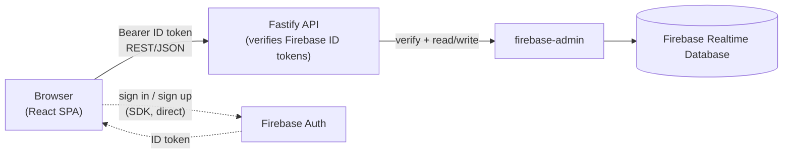

## Smash Tracker

Live demo: https://smash-tracker-f97b7.web.app/ _(placeholder — repoint after Phase 6 deploy)_

Smash Tracker is a match-tracking app for **Super Smash Bros. Ultimate**. Sign in, pick a
primary/secondary fighter, log wins and losses (opponent, stage, match type, notes) after each
set, and review your results: win/loss trends, best/worst matchups, per-stage performance, and
per-opponent history.

This repo is a full rewrite of an older Create React App + Redux + Firebase client-only app into
a typed monorepo with a real API layer in front of Firebase, kept as a portfolio piece.

### Tech stack

**Monorepo**

- pnpm workspaces (managed via corepack), Node 24
- TypeScript 6, strict mode, everywhere
- ESLint 9 (flat config) + typescript-eslint, Prettier 3
- husky + lint-staged (pre-commit formatting)
- Vitest across all three packages (126 tests)

**apps/web**

- Vite 8 + React 19 + React Router 8
- Tailwind CSS v4 + shadcn/ui (Radix primitives)
- TanStack Query 5 (server state/caching) + TanStack Table 8 (match table)
- react-hook-form + zod resolvers (forms)
- chart.js 4 + react-chartjs-2 (win/loss and matchup charts)
- firebase (modular v12) — **Auth only**, for sign-in
- sonner (toasts), lucide-react (icons)

**apps/api**

- Fastify 5 + fastify-type-provider-zod (schema-validated routes, typed end to end)
- firebase-admin 14 — verifies Firebase ID tokens and reads/writes Realtime Database
- zod 4

**packages/shared**

- Zod schemas + inferred TypeScript types shared by both apps, locked to the exact shapes already
  written to production Realtime Database by the legacy app (see
  [`packages/shared/README.md`](./packages/shared/README.md))

### Architecture

The browser talks to the Fastify API over HTTPS with a Firebase ID token as a Bearer credential;
the API is the only thing that touches Realtime Database. The one exception is sign-in itself —
the SPA calls Firebase Auth directly to obtain that ID token, then uses it for every API call.



> Note: `database.rules.json` still allows a user to read/write their own `uid`-scoped paths
> directly, because the legacy CRA app (still the deployed production app) talks to Realtime
> Database directly and needs those rules. Once this rewrite is cut over as the deployed app, the
> rules can be locked down to admin-only (service-account) access, since all reads/writes would
> then go exclusively through the API. See `firebase.json` / `database.rules.json`.

### Monorepo layout

```
smash-tracker/
├── apps/
│   ├── web/                 # Vite + React 19 SPA
│   │   ├── src/
│   │   │   ├── pages/       # Home, Dashboard, CharacterSelect, Matchups, MatchData, FighterAnalysis, NotFound
│   │   │   ├── layouts/     # Main layout: Sidebar, Topbar, Footer
│   │   │   ├── components/  # Shared UI (shadcn primitives, match-form)
│   │   │   ├── context/     # Auth context (onAuthStateChanged)
│   │   │   ├── providers/   # QueryClientProvider, AuthProvider, Toaster
│   │   │   ├── routes/      # react-router routes, ProtectedRoute
│   │   │   ├── lib/         # API client, Firebase SDK init, stats helpers
│   │   │   └── data/        # Static sprite/stage reference data
│   │   └── public/assets/   # Fighter sprites, stage images
│   └── api/                  # Fastify 5 API
│       └── src/
│           ├── routes/      # users, matches, opponents
│           ├── plugins/     # auth (Bearer ID-token verification), cors
│           ├── firebase/    # firebase-admin init
│           ├── config/      # env validation (zod)
│           └── services/    # RTDB access
├── packages/
│   └── shared/               # Zod schemas + types shared by web and api
│       └── README.md         # RTDB data-model documentation
├── legacy/                   # (removed in Phase 5 — see git history for the original CRA app)
├── database.rules.json
├── storage.rules
├── firebase.json
└── .github/workflows/ci.yml
```

### Getting started

**Prerequisites**: Node 24 and [corepack](https://nodejs.org/api/corepack.html) (ships with Node
≥ 16.10; enable with `corepack enable` if it's not already active). Corepack reads this repo's
pinned `packageManager` field and provisions the exact pnpm version automatically — no separate
pnpm install needed.

```bash
git clone https://github.com/bsmerbeck/smash-tracker.git
cd smash-tracker
pnpm install
```

#### 1. Firebase project

You'll need a Firebase project with **Authentication** (email/password + Google providers) and
**Realtime Database** enabled. See the [Firebase web setup docs](https://firebase.google.com/docs/web/setup)
if you're starting from scratch.

- **Web SDK config** (public, safe to expose client-side): Firebase console → Project settings →
  General → Your apps → SDK setup and configuration.
- **API credentials**: a service account JSON key (Project settings → Service accounts → Generate
  new private key) for `firebase-admin`, or point at the local RTDB emulator instead (see below).

#### 2. Environment variables

Each app has a `.env.example` — copy it and fill in your values:

```bash
cp apps/web/.env.example apps/web/.env
cp apps/api/.env.example apps/api/.env
```

- `apps/web/.env.example` — Firebase Web SDK config (`VITE_FIREBASE_*`) and `VITE_API_BASE_URL`
  (the Fastify API's address, defaults to `http://localhost:3001`).
- `apps/api/.env.example` — server port/host, `FIREBASE_DATABASE_URL`, credentials
  (`GOOGLE_APPLICATION_CREDENTIALS` or RTDB emulator vars), and `CORS_ORIGIN`.

`.env` files are gitignored; only the `.env.example` templates are committed.

#### 3. Run the dev servers

```bash
pnpm dev
```

Runs `apps/web` (Vite, default `http://localhost:5173`) and `apps/api` (Fastify with `tsx watch`,
default `http://localhost:3001`) in parallel. Or run one at a time with
`pnpm --filter @smash-tracker/web dev` / `pnpm --filter @smash-tracker/api dev`.

#### Optional: Realtime Database emulator

To develop without touching production data, run the RTDB emulator (needs the
[Firebase CLI](https://firebase.google.com/docs/cli)):

```bash
firebase emulators:start --only database
```

Then set `FIREBASE_DATABASE_EMULATOR_HOST=127.0.0.1:9000` in `apps/api/.env` — `firebase-admin`
will connect to the emulator and no real service-account credentials are required.

### Scripts

Run from the repo root; each fans out to the relevant workspace package(s) via pnpm.

| Script              | What it does                                                                |
| ------------------- | --------------------------------------------------------------------------- |
| `pnpm dev`          | Runs `apps/web` and `apps/api` dev servers in parallel                      |
| `pnpm build`        | Builds all packages (`packages/shared` first, via pnpm's topological order) |
| `pnpm test`         | Builds `packages/shared`, then runs Vitest across all packages              |
| `pnpm lint`         | ESLint across all packages                                                  |
| `pnpm typecheck`    | Builds `packages/shared`, then `tsc` typechecks all packages                |
| `pnpm format`       | Prettier — writes                                                           |
| `pnpm format:check` | Prettier — check only (used in CI)                                          |

### Testing

Vitest across the board: `@testing-library/react` + `@testing-library/user-event` + jsdom for
`apps/web`, Fastify's `inject()` for `apps/api`, plain unit tests for `packages/shared`.
**126 tests** total (21 shared + 30 api + 75 web), including coverage of the critical user flows:
submitting a new match, editing a match, saving a character (fighter) selection, and redirecting
unauthenticated users away from protected routes.

```bash
pnpm test
```

### Deployment

- **Web**: static build output (`apps/web/dist`) deploys to Firebase Hosting —
  `firebase deploy --only hosting` after `pnpm --filter @smash-tracker/web build`. `firebase.json`
  already points `hosting.public` at `apps/web/dist`.
- **API**: `apps/api` needs a persistent Node host (it's a long-running Fastify server, not a
  Cloud Function) — e.g. Cloud Run, Fly.io, or Render. This is **documented but intentionally not
  implemented in this phase**; `apps/api` builds to `dist/` (`pnpm --filter @smash-tracker/api build`)
  and runs with `pnpm --filter @smash-tracker/api start`, so containerizing it is the remaining
  step.

### Data model

`packages/shared` holds the Zod schemas for every Realtime Database shape this app reads and
writes (`users/{uid}`, `primaryFighters/{uid}`, `secondaryFighters/{uid}`, `matches/{uid}/{id}`,
`opponents/{uid}`), reverse-engineered field-for-field from the legacy app so existing production
data keeps working. See [`packages/shared/README.md`](./packages/shared/README.md) for the full
shape reference and provenance notes.

### Disclaimer

I do not claim any rights to the content of the application. All rights belong to Nintendo, and
are not used for any commercial purpose.
